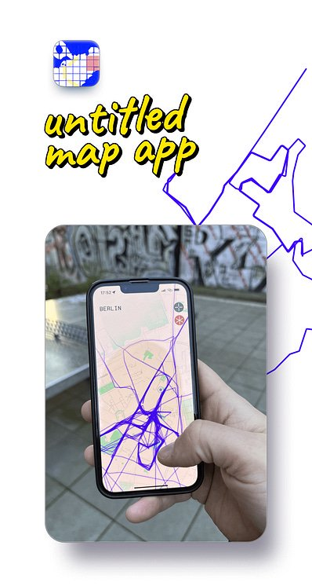

# untitled map app

From Sept. 2022 to Sept. 2023, I worked with 2 other briliant people on [an app to help you go for a walk & explore the world](https://twitter.com/untitledmapapp). It was supposed to have social sharing at some point too, but we never got there, the project got wrapped due to cofounder conflict and lack of resources.

While I will need some time to figure out my next steps, I retain full copyright on the source code written during that year, and decided to share it instead of binning it.

It's capable of quite a few cool things:

- tuned & optimized background geolocation tracking
- fully on-device data processing (except for snap-to-road feature) of location history to revealed fog of war and traced walk path,
- high-def geometry-based fog of war
- scrappy web-engine based multithreading solution

If you're curious, feel free to dig around!

## Building & running

This is a basic managed expo app, and there are a few scripts in `package.json` that should help you find your way.

You need to provide your own secrets to access the map through [Mapbox](https://docs.mapbox.com/help/getting-started/access-tokens/) and provide support for other map services like snap-to-road path tracing. Copy the `.env.example` file to `.env` and set them up there.

## Licensing
The untitled map app source code is shared under a Creative Commons [BY-NC 4.0](https://creativecommons.org/licenses/by-nc/4.0/) license.

You are free to remix, transform, find inspiration in and build upon this work. However, any commercial use is forbidden unless explicitely permitted by copyright holders.

---

###### © 2022-2023 Gabriel Saillard <gabriel@saillard.dev> | Iconography, photography and rasterized assets © 2022-2023 Denis Bolshakov [@danywander](https://twitter.com/danywander)
